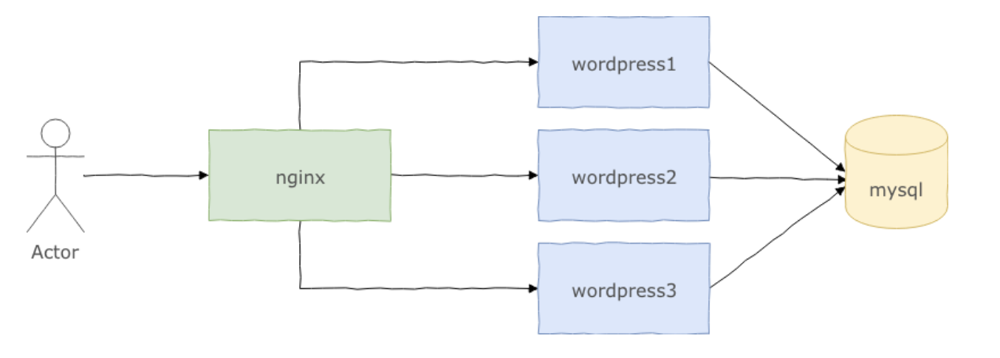
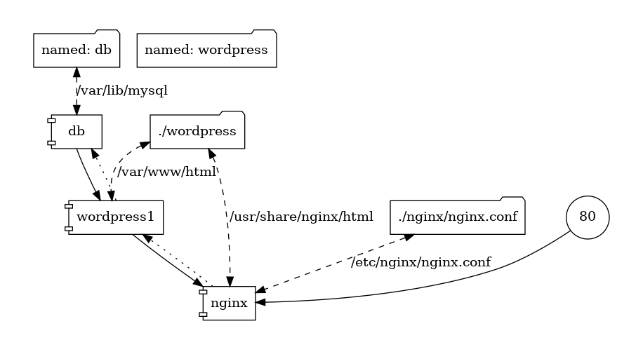

# Trabalho de Sistemas Distribuídos

Configurar o Wordpress com Múltiplas Instâncias Utilizando Nginx e Docker Composer

# Introdução

O objetivo deste trabalho é executar múltiplas instâncias do Wordpress, de modo aumentar sua escalabilidade. Para isso, você deverá instalar e configurar o Nginx como balanceador de carga para as múltiplas instâncias do Wordpress e configurar a aplicação utilizando o Docker Compose.

# Nginx

O Nginx é um servidor de alto desempenho projetado para lidar com alto volume de requisições simultâneas, sendo especialmente adequado para ser utilizado como balanceador de carga para aplicações web como o WordPress.
O balanceamento de carga entre várias instâncias de uma aplicação é uma técnica comumente usada para otimizar a utilização de recursos, maximizando a taxa de transferência, reduzindo a latência, e garantindo configurações tolerantes a falhas.
É possível usar o Nginx como um balanceador de carga HTTP para distribuir o tráfego para várias instância de aplicações, melhorando seu desempenho, escalabilidade e confiabilidade.

# Configuração do Nginx

O Nginx é configurado através de um arquivo de nome nginx.conf, localizado na pasta /etc/nginx/. O exemplo a seguir ilustra um arquivo de configuração definido de modo que o Nginx receba conexões na porta 80 e repasse todos as requisições recebidas em qualquer path para um dos endereços disponíveis no pool de instâncias criado no item de configuração upstream.

```shell
events { worker_connections 1024; }
http {
  upstream wordpress { # configura um pool de endereço de servidores
      server wordpress1;
      server wordpress2;
      server wordpress3;
  }
  server { # configura esse servidor
      listen 80 default_server; # escutando por conexões na porta 80
      listen [::]:80 default_server;
      root /usr/share/nginx/html;
      index index.php;
      location / {
        add_header X-Upstream $upstream_addr;
        proxy_set_header Host $host;
        proxy_set_header X-Real-IP $remote_addr;
        proxy_set_header x-forwarded-for $proxy_add_x_forwarded_for;
  proxy_pass  http://wordpress;
      }
  }
}
```

# Atividade

Criar um arquivo _docker-compose.yml_ que implante cinco contêineres de modo a obter a arquitetura abaixo:



O primeiro contêiner deve executar o Nginx configurado para balancear carga entre três contêineres do Wordpress (wordpress1, wordpress2 e wordpress3). Os três contêineres do Wordpress devem se conectar ao mesmo banco de dados MySQL, permitindo que todos produzam o mesmo conteúdo.

Abaixo algumas informações para concluir a atividade:

- As seguintes imagens devem ser utilizadas: mysql:5.7, wordpress:5.4.2-php7.2-apache e nginx:1.19.0, todas disponíveis no Docker Hub;

- Os contêineres do Wordpress não podem ser acessados diretamente pela máquina hospedeira, apenas pelo Nginx;

- O container do MySQL também não pode ser acessado diretamente pela máquina hospedeira, apenas pelos contêineres do Wordpress;

- Os contêineres do Wordpress devem compartilhar com a máquina hospedeira a pasta /var/www/html;

- O contêiner do Nginx deve mapear a pasta compartilhada pelos contêineres do Wordpress para o caminho /usr/share/nginx/html.

- Para compartilhar um arquivo entre o contêiner e a máquina hospedeira use a seguinte sintaxe na configuração de volumes de um contêiner no arquivo docker-compose:

```shell
volumes
  - /caminho/para/meu-arquivo:/caminho/no/container/arquivo
```

# Como testar?

Após iniciar os cinco contêineres, execute algumas vezes o comando

```shell
  curl -I http://<ip-do-host>/
```

e veja que o cabeçalho HTTP X-Upstream irá assumir três possíveis endereços de IP, que são os IPs dos contêineres do Wordpress. Os mesmo endereços podem ser verificados via navegador, inspecionando a página, na aba Rede.

# Referências

- [Docker Compose](https://docs.docker.com/compose/)

# Executando

Comandos importantes para executar

Subir as imagens:

```shell
  ➜  docker-compose up --always-recreate-deps
```

Descer as imagens

```shell
  ➜  docker-compose down --remove-orphans
```

Comando para ver uma previa impressa do arquivo docker-compose

```shell
➜  docker container run --rm -it --name dcv -v $(pwd):/input pmsipilot/docker-compose-viz render -m image docker-compose.yml
```

Imagem do docker compose



**Saída de teste**

```shell
➜  curl -I http://localhost:80
  HTTP/1.1 302 Found
  Server: nginx/1.19.0
  Date: Thu, 15 Oct 2020 17:27:39 GMT
  Content-Type: text/html; charset=UTF-8
  Connection: keep-alive
  X-Powered-By: PHP/7.2.33
  Expires: Wed, 11 Jan 1984 05:00:00 GMT
  Cache-Control: no-cache, must-revalidate, max-age=0
  X-Redirect-By: WordPress
  Location: http://localhost/wp-admin/install.php
  X-Upstream: 172.19.0.4:80
```

---

```shell
➜  curl -I http://localhost:80
  HTTP/1.1 302 Found
  Server: nginx/1.19.0
  Date: Thu, 15 Oct 2020 17:27:41 GMT
  Content-Type: text/html; charset=UTF-8
  Connection: keep-alive
  X-Powered-By: PHP/7.2.33
  Expires: Wed, 11 Jan 1984 05:00:00 GMT
  Cache-Control: no-cache, must-revalidate, max-age=0
  X-Redirect-By: WordPress
  Location: http://localhost/wp-admin/install.php
  X-Upstream: 172.19.0.7:80
```
