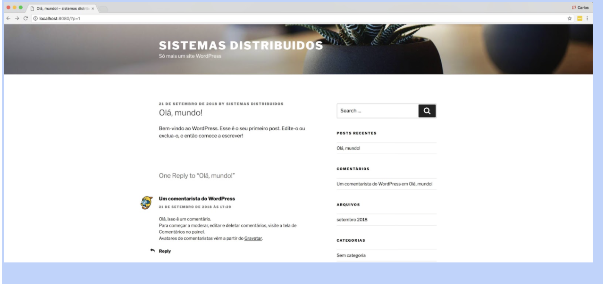

# Trabalho de Sistemas Distribuídos

# Realização de Testes de Carga com Múltiplas Instâncias do Wordpress Utilizando Locust

# Introdução

O objetivo deste trabalho é realizar testes de carga com múltiplas instâncias do Wordpress, tal como configuradas no Trabalho 2. Para isso, você deverá instalar e configurar o Locust, uma ferramenta para geração de carga para aplicações web.

# Teste de Carga

Teste de carga é a prática de modelar o uso esperado de um software através da simulação de múltiplos usuários acessando o software simultaneamente. Essa prática permite ao desenvolvedor do software medir a qualidade de seu serviço através do desempenho percebida pelo usuário final. Existem diversas ferramentas que realizam essa função. Para essa atividade, vamos utilizar o Locust.

# Locust

Locust é uma ferramenta utilizada para executar testes de carga implementada em python. Com ela é possível gerar carga em sites variando a quantidade de usuários simultâneos e a quantidade de requisições feitas por cada usuário. Além desses parâmetros, é possível escrever um script python para simular o comportamento de determinados usuários. Não é necessário conhecimento prévio em python para criar um script. O exemplo abaixo é um script utilizado para fazer uma requisição HTTP do tipo get para a url /. O host da url é informado ao Locust no momento de inicialização do seu respectivo contêiner.

```python
from locust import HttpLocust, TaskSet, task

class UserTasks(TaskSet):

    @task
    def index(self):
        self.client.get("/?p=1") # Realiza um get na url <HOST_DO_WORDPRESS>/?p=1


class WebsiteUser(HttpLocust):
    task_set = UserTasks

```

O script acima faz uma requisição GET na página abaixo. Veja que o host é localhost:8080 e a url que é utilizada no script acima é a ?p=1.



Veja mais exemplos [aqui](https://docs.locust.io/en/stable/quickstart.html#example-locustfile-py)

```python
from locust import HttpLocust, TaskSet

def login(l):
    l.client.post("/login", {"username":"ellen_key", "password":"education"})

def logout(l):
    l.client.post("/logout", {"username":"ellen_key", "password":"education"})

def index(l):
    l.client.get("/")

def profile(l):
    l.client.get("/profile")

class UserBehavior(TaskSet):
    tasks = {index: 2, profile: 1}

    def on_start(self):
        login(self)

    def on_stop(self):
        logout(self)

class WebsiteUser(HttpLocust):
    task_set = UserBehavior
    min_wait = 5000
    max_wait = 9000
```

# Executando o Locust num Contêiner Docker

Existem diversas formas de executar o Locust. Utilizando contêineres Docker é a mais prática delas e é a forma que utilizaremos nessa atividade. A seguir um exemplo utilizando a imagem grubykarol/locust.

```shell
docker run --rm
 -e ATTACKED_HOST=http://<ip do site a ser testado>
 -e LOCUST_OPTS="-c 10 -r 10"
 -v path/to/locust-scripts:/locust
 -p 8089:8089
 grubykarol/locust
```

Atenção para o endereço do site a ser testado! Deve ser utilizado o mesmo endereço ou nome do serviço declarado no docker-compose no Trabalho 2.
A tabela abaixo mostra a lista de variáveis que podem ser utilizadas com o Locust, e que devem ser passadas via variáveis de ambiente através do parâmetro -e ou da section environments: no docker-compose.

|   Variável    |              Descrição               |    Padrão     |      Exemplo       |
| :-----------: | :----------------------------------: | :-----------: | :----------------: |
|  LOCUST_FILE  | Script que será utilizado nos testes | locustfile.py |                    |
| ATTACKED_HOST |    A URL para teste. Obrigatório.    |               | http://example.com |
| zebra stripes |               are neat               |      \$1      |                    |
|  LOCUST_OPTS  |     Opções adicionais do locust.     |               |   "-c 10 -r 10"    |

Veja todos os parâmetros do locust nesse [link](https://docs.locust.io/en/stable/quickstart.html#start-locust)

# Atividade

Realizar testes de carga utilizando o gerador de carga Locust para avaliar o desempenho de diversos cenários de uso do Wordpress, variando a arquitetura da aplicação (número de instâncias do Wordpress) e variando a quantidade de usuários gerados pelo Locust. O contêiner do Locust deve ser definido e adicionado ao docker-compose criado no Trabalho 2.

**Cenários de teste:**

1. Blog post com uma imagem de aproximadamente 1mb;

2. Blog post com um texto de aproximadamente 400kb;

3. Blog post com uma imagem de 300kb;
